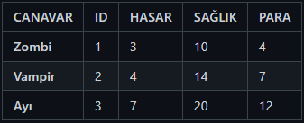

# Adventure Game with Java
Java ile metin tabanlı macera oyunu çalışması.

A text-based adventure game project using Java.

## 📌 Proje Özeti / Project Overview

Bu proje, oyuncunun farklı mekanlarda savaşarak ve kaynak toplayarak ilerlediği bir metin tabanlı macera oyunudur. 
Oyuncu, karakterini seçerek canavarlarla savaşır, mağazadan ekipman alır ve hayatta kalmaya çalışır.

This project is a text-based adventure game where the player progresses by fighting in different locations and collecting resources. 
The player selects a character, battles monsters, purchases equipment from the store, and tries to survive.

---

## 🎯 Karakterler / Characters

## 🎯 Canavarlar / Monsters

## 🎯 Silahlar / Weapons

## 🎯 Zırhlar / Armors

---

## 🎯 Mekanlar / Spaces

✔ Güvenli Ev / Safe House
Özellik : Can Yenileniyor / Feature : Regenerating Health
✔ Mağara / Cave
Canavar : Zombi (1-3 Adet) / Monster : Zombie (1-3)
Eşya : Yemek / Item : Food
✔ Orman / Forest
Canavar : Vampir (1-3 Adet) / Monster : Vampire (1-3)
Özellik : Savaş + Ganimet / Feature : Fighting + Hunting
Eşya : Odun / Item : Firewood
✔ Nehir / River
Canavar : Ayı (1-3 Adet) / Monster : Bear (1-3)
Özellik : Savaş + Ganimet / Feature : Fighting + Hunting
Eşya : Su / Item : Water
✔ Mağaza / Toolstore
Özellik : Destekleyici Eşyalar Satın Almak / Feature : Purchase Support Items
Silah : Tabanca,Kılıç,Tüfek / Weapon : Pistol,Sword,Rifle
Zırh : Hafif,Orta,Ağır / Armor : Light,Medium,Heavy
